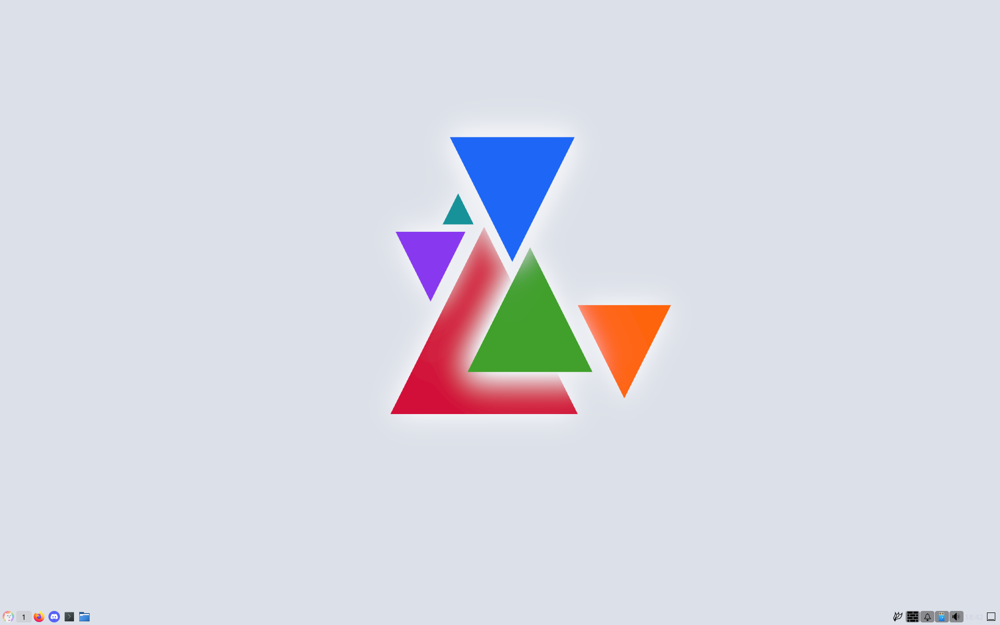
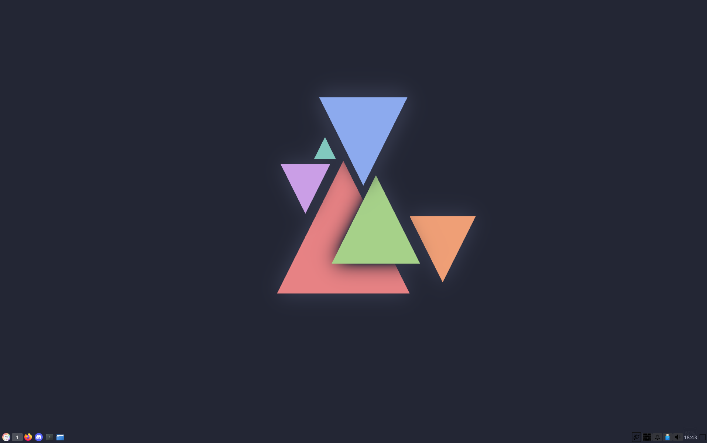

<h3 align="center">
	 
	
	Catppuccin for LXQT
	
</h3>

  

## Previews

🌻 Latte

🪴 Frappé

🌺 Macchiato

🌿 Mocha

## Usage

1. Download the latest release
2. Unzip the file
3. Move the folder to /usr/share/lxqt/themes
4. Go into the "Appearance" settings, click on the LXQT Theme tab and select "Catppuccin"

## 💝 Thanks to

- [DonutDev](https://github.com/DonutDev)

&nbsp;

Copyright &copy; 2021-present <a href="https://github.com/catppuccin" target="_blank">Catppuccin Org</a>

